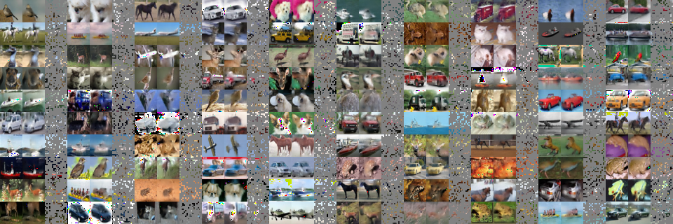

# self-supervised-vision

Implemented:
- [Barlow Twins](https://arxiv.org/abs/2103.03230)
- [MaskedAutoEncoder](https://arxiv.org/abs/2111.06377)

Implemented but still havent reproduced others' results
- [SimCLR](https://arxiv.org/abs/2002.05709)
- [MoCo](https://arxiv.org/abs/1911.05722)

In the works:
- [Byol](https://arxiv.org/abs/2006.07733)

MAE training result:

